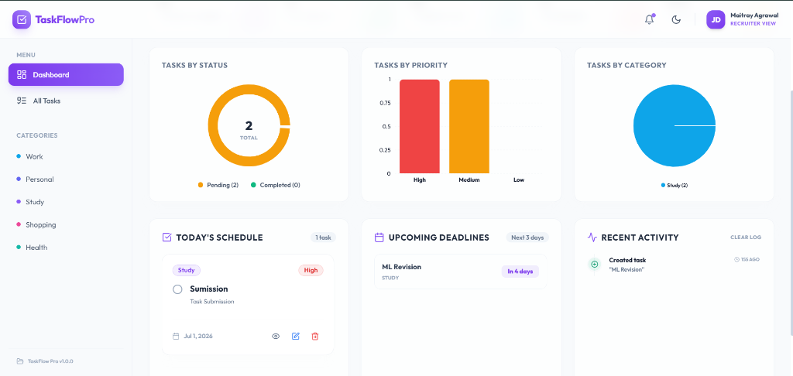
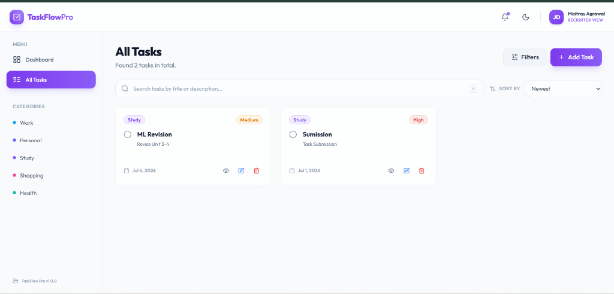
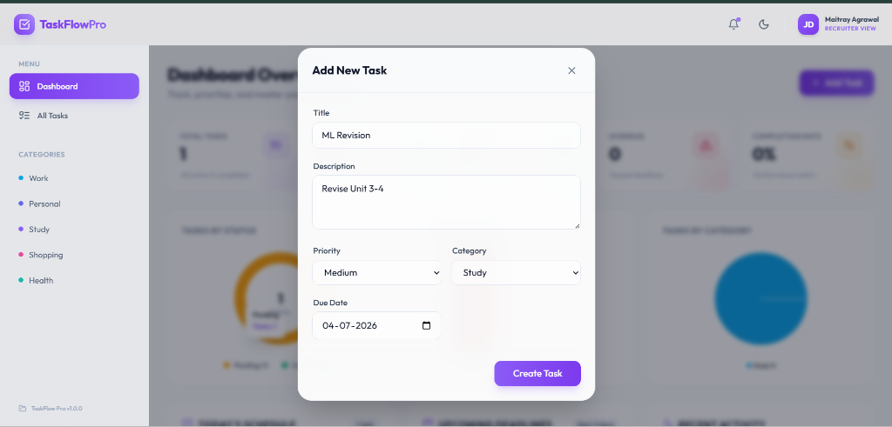
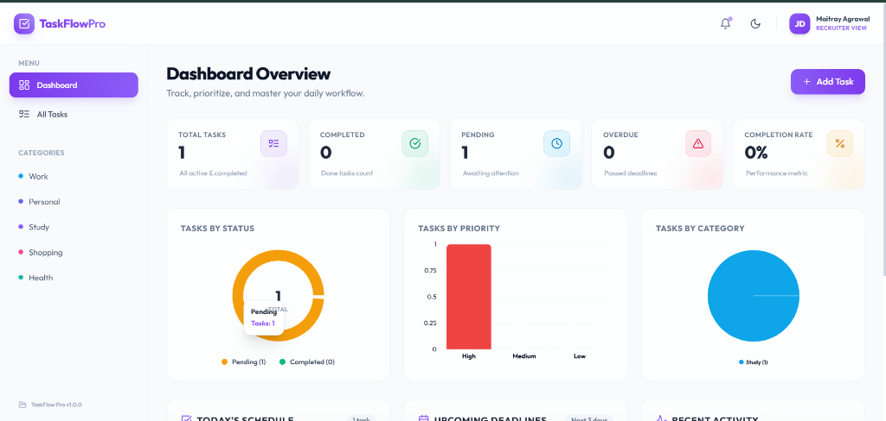

# TaskFlow Pro 🚀
> **Modern MERN Task Management Platform**

TaskFlow Pro is a production-ready, industry-grade Full Stack Task Management application built from scratch to showcase modern web engineering best practices. It features a premium, responsive glassmorphic dark mode UI, native keyboard shortcuts, a dynamic live activity logger, interactive SVG metrics charts, robust schema validations, clean API error envelopes, automated CI/CD pipelines, and multi-container Docker deployment.

---

## Project Overview
TaskFlow Pro is designed to deliver a modern, high-performance task management experience. Using a robust MERN stack with modern ES Module imports, TanStack Query, and a customized CSS system, it bridges the gap between state-of-the-art interactive frontends and secure, performant, and resilient backends.

```text
                       +-----------------------------+
                       |   React 19 Frontend (Vite)  |
                       +--------------+--------------+
                                      |
                                      | HTTP Requests / API Calls (Axios)
                                      v
                       +--------------+--------------+
                       |     Nginx Reverse Proxy     |
                       |       (Port 80 -> 5000)     |
                       +--------------+--------------+
                                      |
                                      | Proxy Pass /api
                                      v
                       +--------------+--------------+
                       |      Express.js Backend     |
                       |       (Node.js Server)      |
                       +--------------+--------------+
                                      |
                        Security Middlewares & Validators
                        (Helmet, rateLimit, express-mongo-sanitize, etc.)
                                      |
                                      v
                       +--------------+--------------+
                       |         Mongoose ODM        |
                       +--------------+--------------+
                                      |
                                      v
                       +--------------+--------------+
                       |          MongoDB            |
                       +-----------------------------+
```

---

## Live Demo
* **Frontend Web Client**: [http://localhost](http://localhost) (when running via Docker Compose) or [http://localhost:5173](http://localhost:5173) (development server)
* **Backend API Server**: [http://localhost:5000](http://localhost:5000)
* **Interactive Swagger UI Docs**: [http://localhost:5000/api/docs](http://localhost:5000/api/docs)

---

## Features

### Backend Features
* **RESTful Controller Design**: Modular architectural handlers for CRUD, query aggregation, and status updates.
* **Safe Regex Query Escaping**: Search param routing contains robust validation that escapes regex characters to prevent Regular Expression Denial of Service (ReDoS).
* **Reliability Process Guards**: Unhandled promise rejections (`unhandledRejection`) and uncaught synchronous exceptions (`uncaughtException`) are caught globally to safely close server ports and connection pools before exiting.
* **Auto-Generating API Docs**: Interactive OpenAPI 3.0 documentation served via Swagger UI at `/api/docs`.
* **Centralized Error Boundary Middleware**: Standardized JSON envelopes for API errors mapping validation errors to clean fields.

### Frontend Features
* **Aesthetic Glassmorphic UI**: Backdrop blurs (`backdrop-blur-md`), dark/light mode themes, and open layout entries powered by Tailwind CSS & Framer Motion.
* **TanStack Query State Syncing**: Caches tasks list, manages garbage collection, and automates route/mutation state refresh.
* **Optimistic UI Updates & Filter-Safe Rollbacks**: Tasks updated or deleted instantly update UI layouts. If API calls fail, the custom query rollback utilizes prefix queries (`getQueriesData`) to restore previous states safely without breaking local search filters.
* **React 19 & Fast Refresh Friendly**: Style mapping variables and keyboard hook callbacks are cached utilizing React `useRef` to maintain compiler Fast Refresh stability and prevent memory leaks.
* **Keyboard-Driven Shortcuts**:
  * `/` Focuses global search input (if not already focused).
  * `n` Opens the Task Creation Modal.
  * `f` Toggles the filters panel.
  * `Escape` Closes modals or clears input focus.
* **SVG Analytics Dashboard Charts**: Recharts visualizations parsing completed task metrics, category breakdown, and priority queues.
* **Live Local Client Activity Logger**: Pub/Sub logger keeping a timeline of local activities (created, updated, status changes, deleted) synchronizing state across layouts.

### Security Features
* **Secure Headers**: Restricts browser features and secures HTTP requests using `helmet`.
* **Payload Sanitation**: Blocks NoSQL injection queries using `express-mongo-sanitize`.
* **HTTP Parameter Pollution**: Prevents parameter pollution and query duplication using `hpp`.
* **Express Rate Limiter**: Limits requests on the `/api/` endpoint to a maximum of 150 requests per 15 minutes per IP.
* **Strict Schema Validators**: Sanitizes incoming payloads using `express-validator` schema rules.
* **Payload Size Limits**: Limits parsing JSON payloads to a maximum of `10kb` to protect against request flooding.

---

## Tech Stack

### Frontend
* **Core**: React 19, Vite, React Router DOM v6
* **State & Fetching**: TanStack Query (React Query) v5, Context API
* **Form Management**: React Hook Form, Zod Schema resolver
* **Styling & UI**: Tailwind CSS, Lucide React Icons
* **Charts**: Recharts
* **Notifications**: React Hot Toast
* **Animations**: Framer Motion
* **Testing**: Vitest, React Testing Library, JSDOM

### Backend
* **Core**: Node.js, Express.js (ES Modules syntax)
* **Database**: MongoDB Atlas, Mongoose ODM
* **Security**: Helmet, Express Mongo Sanitize, HPP, Express Rate Limit
* **Validation**: Express Validator
* **Loggers & Compression**: Morgan, Compression
* **Documentation**: Swagger UI Express, Swagger JSDoc
* **Testing**: Jest, Supertest

---

## Folder Structure
```text
TaskTrack/
├── .github/
│   └── workflows/
│       └── ci.yml             # GitHub Actions CI pipeline configuration
├── backend/
│   ├── config/
│   │   ├── db.js              # Database connection logic
│   │   └── swagger.js         # OpenAPI Swagger configuration
│   ├── controllers/
│   │   └── task.controller.js # CRUD controllers, aggregation pipelines, regex search
│   ├── middlewares/
│   │   ├── error.middleware.js # Centralized backend error parser
│   │   └── validate.middleware.js # Express Validator & ObjectId check middleware
│   ├── models/
│   │   └── task.model.js      # Mongoose schema definitions
│   ├── routes/
│   │   └── task.routes.js     # API routing hooks
│   ├── tests/
│   │   └── task.test.js       # Integration tests suite (Supertest + Jest)
│   ├── utils/
│   │   └── Winston logger setup / config files
│   ├── validators/
│   │   └── task.validator.js  # Request schema validators
│   ├── .env.example           # Example environmental variable file
│   ├── Dockerfile             # Multi-stage production Node.js Docker configuration
│   └── server.js              # Application entry point
├── frontend/
│   ├── src/
│   │   ├── components/
│   │   │   ├── ui/            # UI components (Badge, Button, Input, Modal, Loader)
│   │   │   ├── ErrorBoundary.jsx  # React boundary class
│   │   │   ├── Navbar.jsx     # Header navigation
│   │   │   ├── RecentActivity.jsx # Event logger interface
│   │   │   ├── Sidebar.jsx    # Left-hand filter layout
│   │   │   ├── StatsCharts.jsx # Recharts charts
│   │   │   ├── TaskCard.jsx   # Individual task preview
│   │   │   └── TaskList.jsx   # Grid of current items
│   │   ├── contexts/
│   │   │   └── ThemeContext.jsx  # Dark/Light theme provider
│   │   ├── hooks/
│   │   │   ├── useKeyboardShortcuts.js # Global shortcut handler
│   │   │   └── useTasks.js    # React-Query API hooks (with rollbacks)
│   │   ├── layouts/
│   │   │   └── RootLayout.jsx # Master page layout
│   │   ├── pages/
│   │   │   ├── AllTasks.jsx   # Task grid with search & filters
│   │   │   ├── Dashboard.jsx  # Overview metrics page
│   │   │   ├── NotFound.jsx   # 404 handler
│   │   │   └── TaskDetails.jsx # Detailed task card
│   │   ├── services/
│   │   │   └── api.js         # Axios API connection setup
│   │   ├── styles/
│   │   │   └── index.css      # Core styles & variables
│   │   ├── utils/
│   │   │   ├── activityLogger.js # Client activity timeline helper
│   │   │   └── activityStyles.js # Theme styles for logs
│   │   ├── App.jsx            # Main app file
│   │   └── main.jsx           # Client entrypoint
│   ├── Dockerfile             # SPA static builder & Nginx serving configuration
│   ├── nginx.conf             # Nginx server reverse proxy configuration
│   └── vite.config.js         # Client compilation configuration
├── docker-compose.yml         # Dev/Prod multi-container setup
└── README.md                  # Project documentation
```

---

## Environment Variables

### Backend Environment Variables (`backend/.env`)
Create a `.env` file in the `backend/` directory based on the `.env.example` template:

| Variable Name | Default Value | Description |
| :--- | :--- | :--- |
| `PORT` | `5000` | Port on which the API server runs |
| `MONGODB_URI` | `mongodb://127.0.0.1:27017/taskflow` | Database connection string URI (local or Atlas) |
| `NODE_ENV` | `development` | Runtime environment mode (`development`, `production`, `test`) |
| `FRONTEND_URL` | `http://localhost:5173` | The Client URL to whitelist for CORS access |

### Frontend Environment Variables (`frontend/.env`)
Configure local parameters in `frontend/.env`:

| Variable Name | Default Value | Description |
| :--- | :--- | :--- |
| `VITE_API_URL` | `/api` | Base URL routing endpoint path for API requests |

---

## Installation

### Prerequisites
* Node.js (v20+)
* npm (v10+)
* MongoDB Server installed locally and running on port `27017`

### 1. Launch Backend API Server
```bash
cd backend
npm install
npm run dev
```
* Backend starts at: [http://localhost:5000](http://localhost:5000)
* API Swagger Docs available at: [http://localhost:5000/api/docs](http://localhost:5000/api/docs)

### 2. Launch Frontend Web Client
```bash
cd frontend
npm install --legacy-peer-deps
npm run dev
```
* Frontend starts at: [http://localhost:5173](http://localhost:5173)

---

## Docker Setup
Run the entire stack (React Nginx proxy, Express API backend, MongoDB datastore) via a single command:

```bash
# Build and run all services in background
docker-compose up --build -d

# Verify running containers
docker-compose ps

# View execution logs
docker-compose logs -f
```
The client dashboard will be available at [http://localhost](http://localhost). The Nginx server reverse-proxies all `/api/*` calls transparently to the backend service.

---

## API Documentation

All successful responses return a standardized envelope structure:
```json
{
  "success": true,
  "message": "Action description",
  "data": { ... }
}
```

### Endpoints Directory

| Method | Endpoint | Description | Request Body | Query Parameters | Response Status |
| :---: | :--- | :--- | :--- | :--- | :---: |
| **GET** | `/` | Welcomes client and outputs API version | None | None | `200` |
| **GET** | `/health` | Server uptime status and ping check | None | None | `200` |
| **GET** | `/api/tasks` | Fetches filtered & sorted tasks | None | `q`, `status`, `priority`, `category`, `sortBy`, `page`, `limit` | `200`, `500` |
| **POST** | `/api/tasks` | Creates a new task | Task JSON | None | `201`, `400`, `500` |
| **GET** | `/api/tasks/:id` | Fetches a single task detail | None | None | `200`, `400`, `404` |
| **PUT** | `/api/tasks/:id` | Updates a task entirely | Task JSON | None | `200`, `400`, `404`, `500` |
| **PATCH** | `/api/tasks/:id/status` | Updates completion status | Status JSON | None | `200`, `400`, `404`, `500` |
| **DELETE** | `/api/tasks/:id` | Removes a task permanently | None | None | `200`, `400`, `404` |

### Input JSON Schema Payload Validations

#### 1. Create/Update Task (`POST /api/tasks` & `PUT /api/tasks/:id`)
```json
{
  "title": "Deploy via Docker Compose",
  "description": "Orchestrate MongoDB, React client Nginx container, and Node server.",
  "priority": "High",
  "category": "Work",
  "dueDate": "2026-07-15T18:00:00.000Z"
}
```
* **Valid Categories**: `Personal`, `Work`, `Study`, `Shopping`, `Health`, `Others`
* **Valid Priorities**: `Low`, `Medium`, `High`
* **Validation Rules**: `title` must be 3-100 characters; `dueDate` must be ISO8601 formatted and cannot be a past date.

#### 2. Update Status (`PATCH /api/tasks/:id/status`)
```json
{
  "status": "Completed"
}
```
* **Valid Statuses**: `Pending`, `Completed`

---

## CI/CD
TaskFlow Pro has automated pipeline checks integrated using GitHub Actions in `.github/workflows/ci.yml`.
The workflow runs automatically on every `push` and `pull_request` targeting the `main` or `master` branches:

1. **Backend Integration Job**:
   * Spins up a MongoDB v6.0 container instance service.
   * Installs server packages.
   * Runs the Jest backend unit & integration tests.
2. **Frontend Build & Test Job**:
   * Sets up a Node environment.
   * Installs frontend packages (with legacy peer dependency resolution).
   * Runs Vitest component & hooks tests.
   * Builds the production production static files to ensure code compilation integrity.

---

## Testing
Automated test suites ensure backend security and frontend state recovery integrity.

### 1. Run Backend Integration Tests (Jest & Supertest)
Verify API route responses, input validation rejections, cast ObjectId failures, and regex query sanitization:
```bash
cd backend
npm test
```

### 2. Run Frontend Component Tests (Vitest & RTL)
Verify rendering of the React Error Boundary state recovery, fallback rendering, and local activity logging updates:
```bash
cd frontend
npm test
```

---

## Screenshots

### 1. Interactive Analytics Dashboard Overview
The main dashboard displays high-level task metrics (Total, Completed, Pending, Overdue, and Completion Rate) alongside real-time Recharts visualizations (Task Status donut chart, Task Priority bar chart, Task Category pie chart), a Today's Schedule tracker, and a live client-side event timeline.



---

### 2. Task Grid View
The "All Tasks" view showcases responsive card layouts with dynamic sorting (Newest, Oldest, Priority, Title) and real-text search indexing capabilities.



---

### 3. Task Creation & Editing Interface
An overlay validation dialog powered by React Hook Form + Zod ensures consistent metadata inputs before sending payloads to the MongoDB backend.



---

### 4. Empty Dashboard Metrics State
A clean glassmorphic initial UI layout that guides users through initial task setups.



---

## Future Improvements
* **JWT User Authentication**: Standard security scopes and private task routes.
* **WebSocket Synchronization**: Live task boards synced across multiple concurrent users.
* **Nested Checklists**: Support for subtasks with incremental progress tracking.

---

## Author Information
* **Maitray Agrawal** - *Core Development & Architecture* - [GitHub Profile](https://github.com/maitray-agrawal)